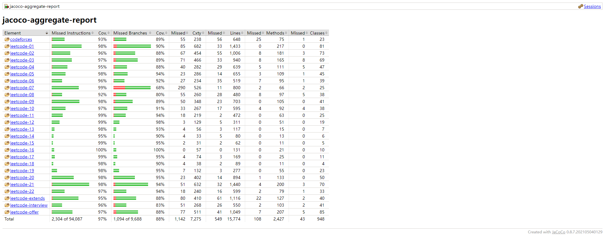

# leetcode-hub-java

基于 `jdk17` + `maven3.8` + `junit5` + `jacoco` 的 leetcode 练习仓库。

~~（拼搏百天，我要完成 300 道 leetcode 题！（始于 2021.07.05，Day87(2021.09.29) 已完成 300 题，Day154(2021.12.05) 已完成 700 题~~

~~（拼搏 300 天，完成 1000 道 leetcode 题！（Day300(2022.04.25) 已完成 1047 题）~~

- `codeforces` 存放 codeforces 题目。
- `leetcode-n` 存放 `100 * (n - 1) + 1` ~ `100 * n` 的题目（如 `leetcode-19` 存放 `1801` ~ `1900` 的题目）。
- `leetcode-core` 存放 leetcode 自定义对象。
- `leetcode-extends` 存放 LCCUP/OJ 题目
- `leetcode-interview` 存放 《程序员面试金典》 题目。
- `leetcode-offer` 存放 《剑指 Offer》 题目。
- `数据库`题目存放于 [https://gitee.com/gdut_yy/leetcode-hub-mysql](https://gitee.com/gdut_yy/leetcode-hub-mysql)

## 环境信息

```sh
$ java -version
openjdk version "17.0.1" 2021-10-19
OpenJDK Runtime Environment (build 17.0.1+12-39)
OpenJDK 64-Bit Server VM (build 17.0.1+12-39, mixed mode, sharing)

$ mvn -v
Apache Maven 3.8.5 (3599d3414f046de2324203b78ddcf9b5e4388aa0)
Maven home: D:\programs\apache-maven-3.8.5
Java version: 17.0.1, vendor: Oracle Corporation, runtime: C:\Program Files\Java\jdk-17.0.1
Default locale: zh_CN, platform encoding: GBK
OS name: "windows 10", version: "10.0", arch: "amd64", family: "windows"

IntelliJ IDEA 2022.1.2 (Community Edition)
Build #IC-221.5787.30, built on June 1, 2022
```

## Command 命令行

```sh
# 运行 UT、统计覆盖率（jdk17）：
mvn clean verify -s settings.xml

# 统计做题进度（python3）：
python countSolutions.py
```



## UT、TDD

java 项目中常见的测试框架：

- [junit4](https://github.com/junit-team/junit4)
- [junit5](https://github.com/junit-team/junit5)
- [testng](https://github.com/cbeust/testng)
- [jmh](https://github.com/openjdk/jmh)
- [jacoco](https://github.com/jacoco/jacoco)

mock 框架：

- [easymock](https://github.com/easymock/easymock)
- [mockito](https://github.com/mockito/mockito)
- [powermock](https://github.com/powermock/powermock)

junit5 常用断言：

- Assertions.assertEquals
- Assertions.assertTrue
- Assertions.assertFalse
- Assertions.assertArrayEquals

思考：一些较为特殊的判题 UT 写法：

1. 部分题目使用了自定义对象（链表、二叉树等），`Assertions.assertEquals` 不能满足这种场景，可使用自定义断言对这类对象进行判等：
   - `ListNode` 可参考 `ListNode#assertListNodeEquals(ListNode expected, ListNode actual)`，如第 2、19、21、23、82 题等；
   - `TreeNode` 可参考 `TreeNode#assertTreeNodeEquals(TreeNode expected, TreeNode actual)`，如第 105、114、156、226、235 题等；
   - 不失一般性地，其他自定义对象可参考 `UtUtils#assertJsonEquals(Object expected, Object actual)`，如第 138、430、708 题等；
2. 部分题目符合题意的答案并不止一个，可以构造一个 `List<T> expectedList` 去判断是否 `contains()` 如第 5、162 题等；
3. 部分题目符合题意的答案是一个集合，但对集合元素的顺序没有要求，可以对 `expected` 和 `actual` 集合进行排序后判等：
   - `List<List<Integer>>` 可参考 `UtUtils#INTEGER_LIST_COMPARATOR`，如第 18、39、40、46、47 题等；
   - `List<List<String>>` 可参考 `UtUtils#STRING_LIST_COMPARATOR`，如第 49、51 题等；
4. 部分题目是非精确判等（随机问题），如第 384、528 题等；

## 一些 Trick

```java
  // 数组 使用 Map<Integer, Integer> 统计每个数值出现的频次
  int[] nums = {4, 1, 2, 1, 2};
  Map<Integer, Integer> cntMap = new HashMap<>();
  for (int num : nums) {
      // Verbose
      if (!cntMap.containsKey(num)) {
          cntMap.put(num, 0);
      }
      cntMap.put(num, cntMap.get(num) + 1);
      // Obvious
      cntMap.put(num, cntMap.getOrDefault(num, 0) + 1);
  }
```

```java
  // 有向图 使用 Map<Integer, List<Integer>> 建图
  int[][] edges = {{0, 1}, {0, 2}, {0, 3}, {1, 4}};
  Map<Integer, List<Integer>> adj = new HashMap<>();
  for (int[] edge : edges) {
      int u = edge[0];
      int v = edge[1];
      // Verbose
      if (!adj.containsKey(u)) {
          adj.put(u, new ArrayList<>());
      }
      adj.get(u).add(v);
      // Obvious
      adj.computeIfAbsent(u, key -> new ArrayList<>()).add(v);
  }
```

## 常用算法模板

### 打表

[预计算结果](https://support.leetcode-cn.com/hc/kb/article/1278066)

预计算结果是指：用户预先计算了部分或全部测试用例结果，并将其直接添加到至提交代码中。

规则及判分方式：如果参赛者的提交代码存在预计算结果的行为，我们建议参赛者附上生成预计算结果的代码。如参赛者含预计算结果的代码 “AC” 了题目，力扣将判定参赛者的提交为有效提交。

- [231. 2 的幂](https://leetcode-cn.com/problems/power-of-two/)
- [326. 3 的幂](https://leetcode-cn.com/problems/power-of-three/)
- [342. 4 的幂](https://leetcode-cn.com/problems/power-of-four/)
- [866. 回文素数](https://leetcode-cn.com/problems/prime-palindrome/)
- [906. 超级回文数](https://leetcode-cn.com/problems/super-palindromes/)
- [1969. 数组元素的最小非零乘积](https://leetcode-cn.com/problems/minimum-non-zero-product-of-the-array-elements/)
- [2048. 下一个更大的数值平衡数](https://leetcode-cn.com/problems/next-greater-numerically-balanced-number/)

### 前缀和/差分数组

[模板代码](./leetcode-core/src/main/java/template/PrefixSum.java)

- `前缀和`：O(n) 预处理；O(1) 得到 nums [i,j] 的累加和。
- `差分数组`：O(1) nums [i,j] 增加 inc；O(n) 求出原数组。

前缀和

- [303. 区域和检索 - 数组不可变](https://leetcode-cn.com/problems/range-sum-query-immutable/)

差分数组

- [845. 数组中的最长山脉](https://leetcode-cn.com/problems/longest-mountain-in-array/) “反向差分”
- [1094. 拼车](https://leetcode-cn.com/problems/car-pooling/) 区间加减
- [1109. 航班预订统计](https://leetcode-cn.com/problems/corporate-flight-bookings/) 区间加减
- [1854. 人口最多的年份](https://leetcode-cn.com/problems/maximum-population-year/) 区间加减

### 二维前缀和/二维差分

[模板代码](./leetcode-core/src/main/java/template/PrefixSum2d.java)

- `二维前缀和`：O(n) 预处理；O(1) 得到 matrix [row1,col1] 到 [row2,col2] 的累加和。
- `二维差分`：O(1) matrix [row1,col1] 到 [row2,col2] 全部增加 inc；O(n) 求出原数组。

二维前缀和

- [304. 二维区域和检索 - 矩阵不可变](https://leetcode-cn.com/problems/range-sum-query-2d-immutable/)

### 线段树

- [218. 天际线问题](https://leetcode-cn.com/problems/the-skyline-problem/) 离散化，区间修改，区间最值
- [699. 掉落的方块](https://leetcode.cn/problems/falling-squares/) 离散化，区间修改，区间最值
- [2286. 以组为单位订音乐会的门票](https://leetcode.cn/problems/booking-concert-tickets-in-groups/) 单点修改、区间求和、二分最小满足下标

### 快速幂

```java
    /**
     * 快速幂 res = a^b % mod
     */
    private int quickPow(long a, long b, int mod) {
        a %= mod;
        long res = 1;
        while (b > 0) {
            if (b % 2 == 1) {
                res *= a;
                res %= mod;
            }
            a *= a;
            a %= mod;
            b /= 2;
        }
        return (int) res;
    }
```

- [1922. 统计好数字的数目](https://leetcode-cn.com/problems/count-good-numbers/)
- [1969. 数组元素的最小非零乘积](https://leetcode-cn.com/problems/minimum-non-zero-product-of-the-array-elements/)

### 矩阵快速幂

```java
    public int tribonacci(int n) {
        int[][] mat = {{1, 1, 1}, {1, 0, 0}, {0, 1, 0}};
        int[][] mPowN = matQuickPow(mat, n);
        int[] f = {0, 1, 1};
        return getFn(f, mPowN);
    }

    /**
     * 矩阵快速幂 res = f(n)
     */
    private int getFn(int[] f, int[][] mPowN) {
        int len = f.length;
        int res = 0;
        for (int i = 0; i < len; i++) {
            res += mPowN[len - 1][i] * f[len - 1 - i];
        }
        return res;
    }

    /**
     * 矩阵快速幂 res[][] = a[][]^n
     */
    private int[][] matQuickPow(int[][] a, int n) {
        int len = a.length;
        // 对角矩阵
        int[][] res = new int[len][len];
        for (int i = 0; i < len; i++) {
            res[i][i] = 1;
        }
        while (n > 0) {
            if ((n & 1) == 1) {
                res = matMulti(res, a);
            }
            n >>= 1;
            a = matMulti(a, a);
        }
        return res;
    }

    /**
     * 矩阵快速幂 res[][] = a[][] * b[][]
     */
    private int[][] matMulti(int[][] a, int[][] b) {
        int len = a.length;
        int[][] res = new int[len][len];
        for (int i = 0; i < len; i++) {
            for (int j = 0; j < len; j++) {
                for (int k = 0; k < len; k++) {
                    res[i][j] += a[i][k] * b[k][j];
                }
            }
        }
        return res;
    }
```

- [70. 爬楼梯](https://leetcode-cn.com/problems/climbing-stairs/)
- [509. 斐波那契数](https://leetcode-cn.com/problems/fibonacci-number/)
- [1137. 第 N 个泰波那契数](https://leetcode-cn.com/problems/n-th-tribonacci-number/)

### 二分查找

```java
    // int mid = (left + right) / 2;
    // 可能会在相加步骤溢出，优化为:
    // int mid = left + (right - left) / 2;

    int left = 0;
    int right = nums.length;
    while (left < right) {
        int mid = left + (right - left) / 2;
        // 边界二分 F, F,..., F, [T, T,..., T]
        // ----------------------^
        if (checkMid(nums, mid)) {
            right = mid;
        } else {
            left = mid + 1;
        }
    }
    return left;
```

二分/边界二分

- [704. 二分查找](https://leetcode-cn.com/problems/binary-search/)
- [34. 在排序数组中查找元素的第一个和最后一个位置](https://leetcode-cn.com/problems/find-first-and-last-position-of-element-in-sorted-array/)

### 双指针

滑动窗口

- [3. 无重复字符的最长子串](https://leetcode-cn.com/problems/longest-substring-without-repeating-characters/) 双指针-滑动窗口
- [76. 最小覆盖子串](https://leetcode-cn.com/problems/minimum-window-substring/) 双指针-滑动窗口
- [438. 找到字符串中所有字母异位词](https://leetcode-cn.com/problems/find-all-anagrams-in-a-string/) 固定大小窗口
- [567. 字符串的排列](https://leetcode-cn.com/problems/permutation-in-string/) 固定大小窗口

快慢指针

- [19. 删除链表的倒数第 N 个结点](https://leetcode-cn.com/problems/remove-nth-node-from-end-of-list/)
- [26. 删除有序数组中的重复项](https://leetcode-cn.com/problems/remove-duplicates-from-sorted-array/)
- [27. 移除元素](https://leetcode-cn.com/problems/remove-element/)
- [83. 删除排序链表中的重复元素](https://leetcode-cn.com/problems/remove-duplicates-from-sorted-list/)
- [141. 环形链表](https://leetcode-cn.com/problems/linked-list-cycle/)
- [142. 环形链表 II](https://leetcode-cn.com/problems/linked-list-cycle-ii/)
- [283. 移动零](https://leetcode-cn.com/problems/move-zeroes/)
- [876. 链表的中间结点](https://leetcode-cn.com/problems/middle-of-the-linked-list/)

### 买卖股票系列

- [121. 买卖股票的最佳时机](https://leetcode-cn.com/problems/best-time-to-buy-and-sell-stock/solution/) 暴力解法、动态规划（Java）
- [122. 买卖股票的最佳时机 II](https://leetcode-cn.com/problems/best-time-to-buy-and-sell-stock-ii/) 暴力搜索、贪心算法、动态规划（Java）
- [123. 买卖股票的最佳时机 III](https://leetcode-cn.com/problems/best-time-to-buy-and-sell-stock-iii/) 动态规划（Java）
- [188. 买卖股票的最佳时机 IV](https://leetcode-cn.com/problems/best-time-to-buy-and-sell-stock-iv) 动态规划（「力扣」更新过用例，只有优化空间的版本可以 AC）
- [309. 最佳买卖股票时机含冷冻期](https://leetcode-cn.com/problems/best-time-to-buy-and-sell-stock-with-cooldown) 动态规划（Java）
- [714. 买卖股票的最佳时机含手续费](https://leetcode-cn.com/problems/best-time-to-buy-and-sell-stock-with-transaction-fee) 动态规划（Java）

### 打家劫舍系列

- [198. 打家劫舍](https://leetcode-cn.com/problems/house-robber/)
- [213. 打家劫舍 II](https://leetcode-cn.com/problems/house-robber-ii/)

### 存在重复元素系列

- [217. 存在重复元素](https://leetcode-cn.com/problems/contains-duplicate/)
- [219. 存在重复元素 II](https://leetcode-cn.com/problems/contains-duplicate-ii/)
- [220. 存在重复元素 III](https://leetcode-cn.com/problems/contains-duplicate-iii/)

### 最大连续 1 的个数

- [485. 最大连续 1 的个数](https://leetcode-cn.com/problems/max-consecutive-ones/)
- [$487. 最大连续 1 的个数 II](https://leetcode-cn.com/problems/max-consecutive-ones-ii/)
- [1004. 最大连续 1 的个数 III](https://leetcode-cn.com/problems/max-consecutive-ones-iii/)

### 广度优先搜索 BFS

```java
public int bfs(char[][] maze, int[] entrance) {
    int mazeM = maze.length;
    int mazeN = maze[0].length;
    int[][] direction = {{1, 0}, {0, 1}, {-1, 0}, {0, -1}};
    maze[entrance[0]][entrance[1]] = '+';
    Queue<int[]> queue = new LinkedList<>();
    queue.add(new int[]{entrance[0], entrance[1], 0});

    while (!queue.isEmpty()) {
        int size = queue.size();
        for (int i = 0; i < size; i++) {
            int[] cur = queue.poll();
            if (cur == null) {
                break;
            }
            for (int[] dir : direction) {
                int nextM = cur[0] + dir[0];
                int nextN = cur[1] + dir[1];
                int step = cur[2] + 1;
                if (nextM >= 0 && nextM < mazeM && nextN >= 0 && nextN < mazeN && maze[nextM][nextN] == '.') {
                    if (nextM == 0 || nextN == 0 || nextM == mazeM - 1 || nextN == mazeN - 1) {
                        return step;
                    }
                    maze[nextM][nextN] = '+';
                    queue.add(new int[]{nextM, nextN, step});
                }
            }
        }
    }
    return -1;
}
```

- [1293. 网格中的最短路径](https://leetcode-cn.com/problems/shortest-path-in-a-grid-with-obstacles-elimination/)
- [1926. 迷宫中离入口最近的出口](https://leetcode-cn.com/problems/nearest-exit-from-entrance-in-maze/submissions/)

### 深度优先搜索 DFS（回溯算法）

- [46. 全排列](https://leetcode-cn.com/problems/permutations/)
- [51. N 皇后](https://leetcode-cn.com/problems/n-queens/)

### 0-1 BFS

- [1368. 使网格图至少有一条有效路径的最小代价](https://leetcode-cn.com/problems/minimum-cost-to-make-at-least-one-valid-path-in-a-grid/)
- [2290. 到达角落需要移除障碍物的最小数目](https://leetcode.cn/problems/minimum-obstacle-removal-to-reach-corner/)

### KMP 算法

- [28. 实现 strStr()](https://leetcode-cn.com/problems/implement-strstr/)

### Manacher 马拉车算法

- [5. 最长回文子串](https://leetcode-cn.com/problems/longest-palindromic-substring/)
- [1960. 两个回文子字符串长度的最大乘积](https://leetcode-cn.com/problems/maximum-product-of-the-length-of-two-palindromic-substrings/)

### 约瑟夫环问题

```java
// n 人，编号 0 ~ n-1
public int josephus(int n, int m) {
    if (n == 1) {
        return 0;
    }
    return (josephus(n - 1, m) + m) % n;
}

// n 人，编号 1 ~ n
public int josephus(int n, int k) {
    if (n == 1) {
        return 1;
    }
    return (josephus(n - 1, k) + k - 1) % n + 1;
}
```

- [1823. 找出游戏的获胜者](https://leetcode-cn.com/problems/find-the-winner-of-the-circular-game/)

### 数制转换

- [12. 整数转罗马数字](https://leetcode-cn.com/problems/integer-to-roman/)
- [13. 罗马数字转整数](https://leetcode-cn.com/problems/roman-to-integer/)
- [504. 七进制数](https://leetcode-cn.com/problems/base-7/)

### 螺旋矩阵

- [54. 螺旋矩阵](https://leetcode-cn.com/problems/spiral-matrix/)
- [59. 螺旋矩阵 II](https://leetcode-cn.com/problems/spiral-matrix-ii/)
- [885. 螺旋矩阵 III](https://leetcode-cn.com/problems/spiral-matrix-iii/)

### 二叉树

二叉树前序遍历 (preorder)、中序遍历 (inorder)、后序遍历 (postorder)

- [144. 二叉树的前序遍历](https://leetcode-cn.com/problems/binary-tree-preorder-traversal/)
- [94. 二叉树的中序遍历](https://leetcode-cn.com/problems/binary-tree-inorder-traversal/)
- [145. 二叉树的后序遍历](https://leetcode-cn.com/problems/binary-tree-postorder-traversal/)

扩展到 N 叉树（N 叉树没有 中序遍历）

- [589. N 叉树的前序遍历](https://leetcode-cn.com/problems/n-ary-tree-preorder-traversal/)
- [590. N 叉树的后序遍历](https://leetcode-cn.com/problems/n-ary-tree-postorder-traversal/)

二叉树层序遍历

- [102. 二叉树的层序遍历](https://leetcode-cn.com/problems/binary-tree-level-order-traversal/)
- [107. 二叉树的层序遍历 II](https://leetcode-cn.com/problems/binary-tree-level-order-traversal-ii/)
- [103. 二叉树的锯齿形层序遍历](https://leetcode-cn.com/problems/binary-tree-zigzag-level-order-traversal/)
- [104. 二叉树的最大深度](https://leetcode-cn.com/problems/maximum-depth-of-binary-tree/)
- [111. 二叉树的最小深度](https://leetcode-cn.com/problems/minimum-depth-of-binary-tree/)
- [637. 二叉树的层平均值](https://leetcode-cn.com/problems/average-of-levels-in-binary-tree/)

```java
public List<List<Integer>> levelOrder(TreeNode root) {
    List<List<Integer>> resList = new ArrayList<>();
    if (root == null) {
        return resList;
    }
    Queue<TreeNode> queue = new LinkedList<>();
    queue.add(root);
    while (!queue.isEmpty()) {
        List<Integer> curLevel = new ArrayList<>();
        int size = queue.size();
        for (int i = 0; i < size; i++) {
            // 上下文已保证 cur 不为 null
            TreeNode cur = queue.remove();
            curLevel.add(cur.val);
            if (cur.left != null) {
                queue.add(cur.left);
            }
            if (cur.right != null) {
                queue.add(cur.right);
            }
        }
        resList.add(curLevel);
    }
    return resList;
}
```

二叉树序列化

- [297. 二叉树的序列化与反序列化](https://leetcode-cn.com/problems/serialize-and-deserialize-binary-tree/)
- [449. 序列化和反序列化二叉搜索树](https://leetcode-cn.com/problems/serialize-and-deserialize-bst/)

其他

- [100. 相同的树](https://leetcode-cn.com/problems/same-tree/)
- [114. 二叉树展开为链表](https://leetcode-cn.com/problems/flatten-binary-tree-to-linked-list/)
- [116. 填充每个节点的下一个右侧节点指针](https://leetcode-cn.com/problems/populating-next-right-pointers-in-each-node/)
- [226. 翻转二叉树](https://leetcode-cn.com/problems/invert-binary-tree/)

### 单调栈

注意：Java 中 "栈" 应使用 Deque 代替 Stack（Java 官方建议）。即：

```java
// Bad
Stack<T> stack = new Stack<>();

// Good
Deque<T> stack = new ArrayDeque<>();
```

注意二者转 stream 时的顺序：

```java
Stack<Integer> stack1 = new Stack<>();
Deque<Integer> stack2 = new ArrayDeque<>();
stack1.push(1); stack1.push(2); stack1.push(3);
stack2.push(1); stack2.push(2); stack2.push(3);
System.out.println(Arrays.toString(stack1.stream().mapToInt(i -> i).toArray())); // [1, 2, 3]
System.out.println(Arrays.toString(stack2.stream().mapToInt(i -> i).toArray())); // [3, 2, 1]
```

- [496. 下一个更大元素 I](https://leetcode-cn.com/problems/next-greater-element-i/)
- [503. 下一个更大元素 II](https://leetcode-cn.com/problems/next-greater-element-ii/)
- [739. 每日温度](https://leetcode-cn.com/problems/daily-temperatures/)
- [1944. 队列中可以看到的人数](https://leetcode-cn.com/problems/number-of-visible-people-in-a-queue/)

### 状态压缩 DP

```java
public List<List<Integer>> subsets(int[] nums) {
    List<List<Integer>> resList = new ArrayList<>();
    int len = nums.length;
    // 状态压缩 dp
    for (int state = 0; state < (1 << len); state++) {
        List<Integer> curList = new ArrayList<>();
        for (int k = 0; k < len; k++) {
            // 第 k 位被选中
            if (((state >> k) & 1) == 1) {
                curList.add(nums[k]);
            }
        }
        resList.add(curList);
    }
    return resList;
}
```

- [78. 子集](https://leetcode-cn.com/problems/subsets/)
- [90. 子集 II](https://leetcode-cn.com/problems/subsets-ii/)
- [1049. 最后一块石头的重量 II](https://leetcode-cn.com/problems/last-stone-weight-ii/)
- [1755. 最接近目标值的子序列和](https://leetcode-cn.com/problems/closest-subsequence-sum/)
- [2035. 将数组分成两个数组并最小化数组和的差](https://leetcode-cn.com/problems/partition-array-into-two-arrays-to-minimize-sum-difference/)

### 只出现一次的数字系列

1. [136. 只出现一次的数字](https://leetcode-cn.com/problems/single-number/)
2. [137. 只出现一次的数字 II](https://leetcode-cn.com/problems/single-number-ii/)
3. [260. 只出现一次的数字 III](https://leetcode-cn.com/problems/single-number-iii/)

```java
// 给定一个非空整数数组，除了某个元素只出现一次以外，其余每个元素均出现两次。找出那个只出现了一次的元素。
public int singleNumber(int[] nums) {
    int single = 0;
    for (int num : nums) {
        single ^= num;
    }
    return single;
}

// 给你一个整数数组 nums ，除某个元素仅出现 一次 外，其余每个元素都恰出现 三次 。请你找出并返回那个只出现了一次的元素。
public int singleNumber2(int[] nums) {
    int a = 0;
    int b = 0;
    for (int num : nums) {
        b = ~a & (b ^ num);
        a = ~b & (a ^ num);
    }
    return b;
}

// 给定一个整数数组 nums，其中恰好有两个元素只出现一次，其余所有元素均出现两次。找出只出现一次的那两个元素。你可以按 任意顺序 返回答案。
public int[] singleNumber2(int[] nums) {
    int xorsum = 0;
    for (int num : nums) {
        xorsum ^= num;
    }
    // 防止溢出
    int lsb = (xorsum == Integer.MIN_VALUE ? xorsum : xorsum & (-xorsum));
    int type1 = 0;
    int type2 = 0;
    for (int num : nums) {
        if ((num & lsb) != 0) {
            type1 ^= num;
        } else {
            type2 ^= num;
        }
    }
    return new int[]{type1, type2};
}
```

### 图论

- 顶点 Vertex (复数 vertices)
- 边 Edge
- 有向图 directed graph
- 无向图 undirected graph
- 有向无环图 DAG (Directed Acyclic Graph)
- 入度 indegree
- 出度 outdegree

### 拓扑排序 (Topological Sort)

每次将入度为 0 的顶点加入队列。

- [207. 课程表](https://leetcode-cn.com/problems/course-schedule/)
- [210. 课程表 II](https://leetcode-cn.com/problems/course-schedule-ii/)
- [$269. 火星词典](https://leetcode-cn.com/problems/alien-dictionary/) [困难]
- [$444. 序列重建](https://leetcode-cn.com/problems/sequence-reconstruction/)
- [1136. 平行课程](https://leetcode-cn.com/problems/parallel-courses/)
- [2050. 并行课程 III](https://leetcode-cn.com/problems/parallel-courses-iii/) [困难]

### 并查集 (UnionFind)

[模板代码](./leetcode-core/src/main/java/template/UnionFind.java)

- [200. 岛屿数量](https://leetcode-cn.com/problems/number-of-islands/)
- [$323. 无向图中连通分量的数目](https://leetcode-cn.com/problems/number-of-connected-components-in-an-undirected-graph/)
- [547. 省份数量](https://leetcode-cn.com/problems/number-of-provinces/)
- [684. 冗余连接](https://leetcode-cn.com/problems/redundant-connection/)
- [765. 情侣牵手](https://leetcode-cn.com/problems/couples-holding-hands/) [困难]
- [839. 相似字符串组](https://leetcode-cn.com/problems/similar-string-groups/)
- [990. 等式方程的可满足性](https://leetcode-cn.com/problems/satisfiability-of-equality-equations/)
- [1319. 连通网络的操作次数](https://leetcode-cn.com/problems/number-of-operations-to-make-network-connected/)
- [1992. 找到所有的农场组](https://leetcode-cn.com/problems/find-all-groups-of-farmland/)
- [2076. 处理含限制条件的好友请求](https://leetcode-cn.com/problems/process-restricted-friend-requests/) [困难]

### 最短路 (Shortest Path)

- Floyd 求任意两个结点之间的最短路。 时间复杂度 O(n^3)
- Dijkstra 求解 非负权图 上单源最短路径的算法。时间复杂度 O(n^2) / O(mlogn)
- Bellman ford 可以求出有负权的图的最短路 时间复杂度 O(mn)

- [743. 网络延迟时间](https://leetcode-cn.com/problems/network-delay-time/)
- [1368. 使网格图至少有一条有效路径的最小代价](https://leetcode-cn.com/problems/minimum-cost-to-make-at-least-one-valid-path-in-a-grid/)
- [1514. 概率最大的路径](https://leetcode-cn.com/problems/path-with-maximum-probability/)

### 欧拉回路 (Eulerian Circuit)

Hierholzer 算法

- [332. 重新安排行程](https://leetcode-cn.com/problems/reconstruct-itinerary/)

### 二分图最大权匹配

二部图 Bipartite Graph

匈牙利算法（KM 算法）

- [1066. 校园自行车分配 II](https://leetcode-cn.com/problems/campus-bikes-ii/)
- [1947. 最大兼容性评分和](https://leetcode-cn.com/problems/maximum-compatibility-score-sum/)

### 最小生成树 (Minimum Spanning Trees)

- Prim（普里姆）算法
- Kruskal（克鲁斯卡尔）算法 边优先 O(mlogm) m 条边

---

- [$1135. 最低成本联通所有城市](https://leetcode-cn.com/problems/connecting-cities-with-minimum-cost/)
- [$1168. 水资源分配优化](https://leetcode-cn.com/problems/optimize-water-distribution-in-a-village/)
- [1489. 找到最小生成树里的关键边和伪关键边](https://leetcode-cn.com/problems/find-critical-and-pseudo-critical-edges-in-minimum-spanning-tree/)
- [1584. 连接所有点的最小费用](https://leetcode-cn.com/problems/min-cost-to-connect-all-points/)

### 网络流问题 (Network Flow Problems)

- Ford-Fulkerson 算法（最坏情况时间复杂度 O(f\*m) f 为最大流大小 m 为边的数量）
- Edmonds-Karp 算法 最短路 时间复杂度 O(n\*m^2) n 为顶点数量 m 为边数量
- Dinic 算法 时间复杂度 O(m\*n^2) level graph

## 学习资源

- [OI-Wiki](https://oi-wiki.org/)
- [codeforces](https://codeforces.com/)
- [北大 OJ](http://poj.org/)
- [中科大 OJ](http://acm.ustc.edu.cn/ustcoj/)
- [杭电 OJ](https://www.acm.hdu.edu.cn/)
- [哈工大 OJ](http://acm.hit.edu.cn/)
- [洛谷](https://www.luogu.com.cn/)
- [excalidraw](https://excalidraw.com/)
- [leetcode-rating-predictor](http://lcpredictor.herokuapp.com/) | [github](https://github.com/SysSn13/leetcode-rating-predictor)
- [zerotrac-leetcode_problem_rating](https://zerotrac.github.io/leetcode_problem_rating/)
- [visualgo](https://visualgo.net/zh)

（全文完）
